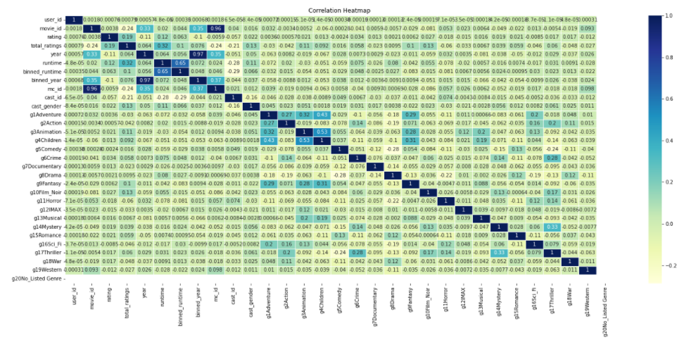

# An Analysis of the Trends Between Films and User Ratings

## **Film-Rating Database and Analysis**

#### **Reason For Selection**:
The reason we selected this topic is because streaming services are currently on the rise. There are multiple streaming services to choose from and what's better than a streaming service that knows the consumer best? By taking our algorithm we are able to predict which new film would best fit the consumer. 

#### **Questions Considered**:
What rating would a new film receive, when considered against other films listed in the database? Combining the following: genre, director, cast, budget, ratings, etc. 

#### **Data Sources**:
- [MovieLens - Kaggle](https://www.kaggle.com/grouplens/movielens-latest-full)
- [TMDB 5000 Movie Dataset- Kaggle](https://www.kaggle.com/tmdb/tmdb-movie-metadata)
- [The Movies Dataset- Kaggle](https://www.kaggle.com/rounakbanik/the-movies-dataset?select=ratings_small.csv)

### Google Slides
[Google Slides](https://docs.google.com/presentation/d/1l5JNNvdjFWGLZJCt2bUP6EqvaZgqcJNhIDLShZntfgo/edit?usp=sharing)

### Roles
- Harry Manning (Github Repository Management)
- Falguni Mital (Machine Learning Model Creation and Optimization)
- David Kaye (Database Construction and Organization)
- Daniel Villafane (Data Visualization Generation and Presentation)
- Jorge Claros (README File and Project Report Creation)

### Communication Protocols:
1. Slack (Main point of Communication)
2. Zoom (Meeting 2-3 times a week outside of classtime)
3. Text Messages

### **Project Plan Overview**:

#### Technology Used:
* Jupyter notebook
* PostgresSQL
* PowerBI
* Amazon Web Services ERD Host
* Google Slides

#### Database & ERD Model:

##### PostgreSQL Database Layout
- 

#### Dashboard Examples

#### Machine Learning:

##### ML Techniques Used:

Regression techinique is used to find out the relationship between a single dependent variable (target variable) on the several independent ones (features). 

For this analysis several regression machine learning techniques from sklearn library are implemented to predict the movie ratings:

  1. Linear Regression:   finds out a linear relationship between a dependent variable and the other given independent variables.  Prone to overfitting and handles outliers badly.
  2. Lasso Linear Regressor: this technique is basically a shrinkage and variable selection method and it helps to determine which of the predictors are most important. The purpose of lasso is to stabilize the linear regression and make it more robust against outlier, overfitting.
  3. Random Forest Regressor:  this technique samples the data and build several smaller, simpler decision trees. Each tree is simpler because it is built from a random subset of features.
  - *[Selected Models Testing File](Jupyter_Notebook_Files/movies_ML_Analysis.ipynb)*
  
  4. Gaussian Process Regressor: generic supervised learning method designed to solve regression and probabilistic classification problems
  5. Decision Trees: Decision trees are good at capturing non-linear interaction between the features and the target variable. 
  6. Extra Tree Regressor - An extremely randomized tree regressor.  Extra-trees differ from classic decision trees in the way they are built
  7. KNeighbors Regressor - Regression based on k-nearest neighbors.  The target is predicted by local interpolation of the targets associated of the nearest neighbors in the training set.
  - *[Selected Models Testing File](Jupyter_Notebook_Files/Static_Data_Algorithm_Testing.ipynb)*
  

##### Preprocessing Data:

Data Selection Process included :
- Reviewing availalbe data columns, types, missing data
- Removed Nulls
- Removed Duplicates

Movies Dataset:
- Bin Movie Runtime into 5 bins [MovieRuntime.PNG](Images/MovieRuntime.PNG)
- Bin Movie Release Year into 9 bins [MovieReleaseYearBins.PNG](Images/MovieReleaseYearBins.PNG)
- Filter Movie Runtime to keep moves greater than 60 min and less than 180 minutes

Ratings Dataset:
- Filter Ratings - Keep ratings for movies which have more than 5000 ratings 

Movie Genre Dataset:
- Transform Movie Genre from Category to Numerical Value

Scale Data using Standard Scalar

##### Feature Selection Techniques Used:

- Correlation:

- Random Forest Importance:

Features:

- Movie Genre
- Movie Runtime
- Movie Release Year
- Movie Cast ID 
- Movie Cast Gender
- Complete list of features, see [RandomForestFeatureImpList.PNG](Images/RandomForestFeatureImpList.PNG)

Target:

- Movie Ratings

Dataset is split into two parts - 75% of the data is allocated to training and 25% is allocated to testing using train_test_split from sklearn library.

##### Model Evaluation:

R Squared will be used to determine how well each model has performed and the best performing model will be used to make movie recommendations.

##### Results:

The two linear regression techniques which gave the best R Squared values are:
- Decision Trees Regressor: 
    R Squared: 0.1896050371860699
    - [Jupyter Notebook File with Code](Jupyter_Notebook_Files/ML_Dataframe_and_Model_Creation.ipynb)
- Random Forest Regressor: 
    R Squared: 0.06641313954915906
    - [Jupyter Notebook File With Code](Jupyter_Notebook_Files/movies_ML_Analysis.ipynb)
    
The remaining techniques: Linear Regresion, Lasso, Gaussian Process Regressor, KNeighbor Regressor, all resulted in lower R Squared values and were not considered for generating the final model predictions. In addition, the Gaussian Regressor Technique requires more memory than currently available on any machine to run the full dataset, and reduced versions of the dataset would limit the use that such a model would offer for understanding our full dataset.

We concluded the Decision Tree Regressor was the ideal algorithm to create a model and predict movie ratings, as it provided the best R Squared values in all tests.  

A Coefficient of Determination(R-Squared) value returned by the model is the percentage match between the model's predicted values and the dataset's real values. The closer an R-Squared value is to 1.0 (or 100%) the better the model performs in predicting target value based on the relevant features included in the dataset.

Although the R-Squared value is low, it reflects the variance between the predicted and real values across millions of data rows, indicating there is a limit to how close the model's accuracy can get to 1.0. The largest restriction in reaching a high R-Squared value is how the variance compounds with each inaccurate prediction and the large number of rows will amplify the impact of all inaccuracies.

